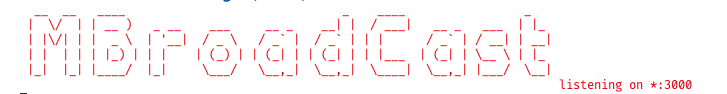

# Masonite Broadcast Server

<p align="center">
    
</p>

## Introduction (WIP)

Broadcast server for masonite framework. It is a simple server that can be used to broadcast messages to all connected clients using socket-io.

### Getting Started

Install the package using yarn or npm:

```sh
$ yarn add masonite-broadcast-server -g
$ npm install masonite-broadcast-server -g
```

### Start the Server

You can start the server using the following command:

```sh
$ mbroadcast start
$ mboradcast start --port=3000 --host=127.0.0.1
```




### WIP
Because of tricky time and stuff I am not able to complete this library yet, but I am working on it. I will update the features and fix bugs as soon as I get time. If you can help me complete this library, please send me a pull request.
